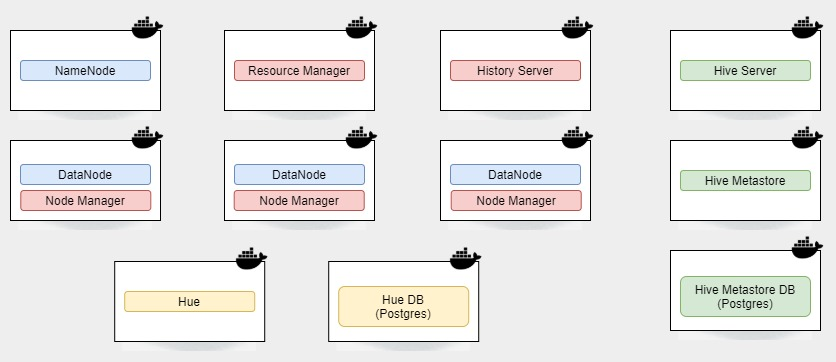

# Docker - Hadoop/Hive/Spark

## Objetivo

Disponibilizar um ambiente Hadoop com Hive e Spark configurados, simulando um mini cluster com 3 nós de processamento e armazenamento.

O "mini cluster" está configurado para:

- [Utilizar o Spark como execution engine do Hive](https://cwiki.apache.org/confluence/display/Hive/Hive+on+Spark%3A+Getting+Started)
- [Utilizar o YARN para execução de jobs do Spark](https://spark.apache.org/docs/latest/running-on-yarn.html)

## Pré requisitos

- Docker e Docker Compose (Inclusos no [Docker Desktop](https://www.docker.com/products/docker-desktop))

## Como subir o ambiente

Para efetuar o build das imagens, e iniciar os contêineres, utilize o comando abaixo (*O primeiro build poderá levar alguns minutos*):

`docker-compose -f "docker-compose.yml" up -d`

Serão iniciados 11 contêineres, conforme a ilustração:

- Namenode: http://localhost:50070/
- Datanode 1: http://localhost:50075/
- Datanode 2: http://localhost:50076/
- Datanode 3: http://localhost:50077/
- Resource Manager: http://localhost:8088/
- History Server: http://localhost:8188/
- Hue: http://localhost:8888/
- HiveServer2 UI: http://localhost:10002/ (*Este serviço leva alguns segundos para iniciar*)

Utilize o ambiente para fins <b>didáticos</b>! 
Esse ambiente não possui as configurações recomendadas/adequadas para produção.

## Como encerrar o ambiente

Utilize o comando abaixo:

`docker-compose -f "docker-compose.yml" down`

## Referências

https://github.com/big-data-europe/docker-hadoop